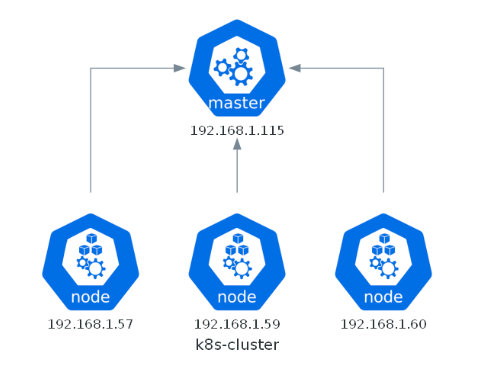

# Running Kubernetes on a raspberry Pi

Overview of Kubernetes cluster running on 3 Raspbberry Pi's and a mini-PC. I followed the steps on this site to get my cluster up and running. It's nice as it has a list of the components and where you could get them.

[https://averywagar.com/post/k3s-pi/](https://averywagar.com/post/k3s-pi/)

